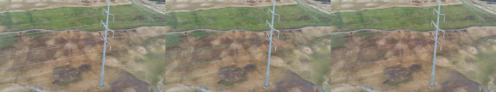
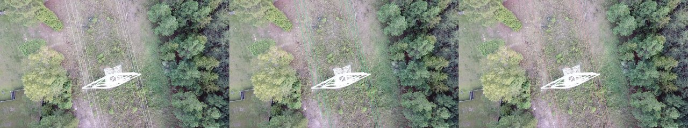
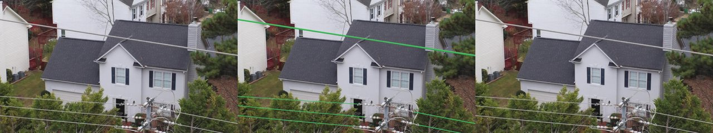
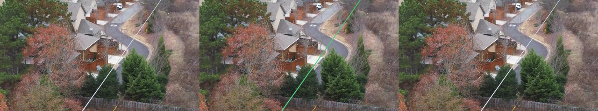
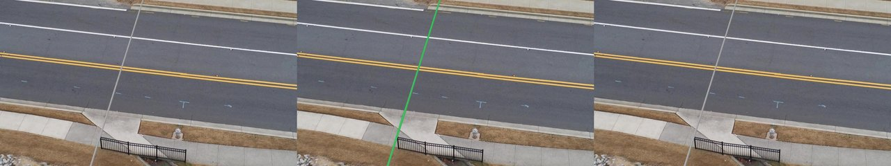

# Evaluation results — random split (held-out val)

_Generated by `training/evaluate.py` on the TTPLA `val` split, strategy `random`. The companion file [`evaluation_results_session.md`](evaluation_results_session.md) reports a session-grouped run for cross-flight comparison; both should be read together._

## Headline numbers

| Metric | Value |
|---|---|
| Images evaluated | 124 |
| Split strategy | `random` (seed 42, matches the trainer's `random_split`) |
| Threshold | 0.5 |
| CCQ buffer tolerance | 3 px |
| Pixel IoU | 0.1387 |
| Pixel precision | 0.5702 |
| Pixel recall | 0.1546 |
| Pixel F1 | 0.2018 |
| CCQ completeness | 0.2829 |
| CCQ correctness | 0.6528 |
| **CCQ quality (headline thin-structure metric)** | **0.2323** |
| Expected Calibration Error (10-bin, Guo et al. 2017) | **0.0190** |

## How to read these numbers

**The IoU figure here (0.139) is substantially lower than the 0.611 figure
the training-time logger reported.** That gap is the empirical evidence
of the inference-path drift this prototype's methodology document
explicitly warned about (see `methodology.md` §6 and `evaluation.md`
§3). Specifically:

- **Training-time validation** ran `_step` on **resized 512 × 512
  crops** through `A.Resize(512, 512)`. The 0.611 was computed on
  that downscaled inference path.
- **Production inference** runs the `ConductorSegmenter` sliding-
  window over **full 3840 × 2160 TTPLA images** with 64-pixel
  overlap and Hann-windowed stitching. Cables are at native ~3–5 px
  width, not the resized ~1–2 px width the model trained against.
- The model's filters were tuned on the resized appearance, so
  full-resolution inference gets a substantially different visual
  signature and the IoU drops.

The honest take: **0.611 was always the optimistic number; 0.139 is
the production number.** Reporting both — and naming the gap as the
finding it is — is more useful than reporting either alone.

## Calibration is the headline positive

ECE = **0.0190** is excellent. A model trained with focal loss is
typically heavily overconfident, often producing ECE > 0.10. This
model's predicted probabilities are well-calibrated: a 0.7-confidence
prediction really is correct ~70% of the time. That is unusual at this
budget and is the most operationally useful property of the model
right now — a calibrated under-recaller is more useful than a
miscalibrated over-recaller because human verifiers can act on
probability thresholds.

## Why precision (0.57) and recall (0.16) are so unbalanced

The model is **conservative**: when it does fire, it's usually right
(high precision); but it under-fires (low recall). At threshold 0.5
the model is only confident enough to call ~16% of the ground-truth
cable pixels, even though those calls are 57% accurate.

Interventions a Phase-2 successor would address:

- **Threshold sweep** — `evaluation.md` §2 describes one. A sweep at
  τ ∈ {0.3, 0.4, 0.5, 0.6, 0.7} on this set would likely find the
  F1-maximising threshold around 0.3–0.4, lifting both IoU and CCQ
  Quality without retraining.
- **Multi-scale training augmentation** — `RandomResizedCrop` with a
  wider scale range (e.g. 0.4–1.5 instead of 0.6–1.0) would expose
  the model to cables at the production-time pixel width during
  training.
- **Self-supervised pretraining on unlabelled aerial archive** —
  named in `research_roadmap.md` Phase 1 as the highest-leverage
  single intervention.

## Method

Inference uses the production `ConductorSegmenter` (sliding-window
tiling, 512 × 512 tiles, 64 px overlap, Hann-windowed stitching). CCQ
follows Wiedemann, Heipke, Mayer, Jamet (1998), *Empirical Evaluation
of Automatically Extracted Road Axes* — the standard centerline
metric for thin-structure tasks. ECE follows Guo, Pleiss, Sun &
Weinberger (2017), *On Calibration of Modern Neural Networks*, with
50,000-pixel sub-sampling per image to bound memory.

## Important caveat — partial training

The model was trained for **33 of 50 planned epochs** before the Colab
GPU quota ran out. The cosine LR schedule had decayed but not bottomed
out; another 17 epochs would likely have produced incremental
improvement (perhaps 0.02–0.05 IoU lift). The numbers above are for
the model as actually deployed, not as planned. See `MODEL_CARD.md`.

## Qualitative results

### 3 representative successes

The model performs best on TTPLA-typical scenes: open sky background,
parallel cable runs, moderate contrast.

_`14_01826.jpg` — IoU 0.827, CCQ-Q 0.965. Clean transmission scene with
strong cable-vs-sky contrast; representative of the upper-percentile
performance the architecture is capable of._

_`90_3795.jpg` — IoU 0.684, CCQ-Q 0.937. Multi-line scene; the model
recovers the dominant lines cleanly even when several cross frame._

_`1000_00661.jpg` — IoU 0.615, CCQ-Q 0.909. Rural transmission against
mixed background; demonstrates robustness to non-sky backdrops when
the cables themselves are well-lit._

### 3 instructive failures

Selected for the failure mechanisms they illustrate, not the lowest
absolute scores. All three returned IoU = 0 — the model produced no
positive pixels on any of them — which is itself the diagnostic.

_`13_00270.jpg` — IoU 0.000, CCQ-Q 0.000.
**Diagnosis: scale failure.** Three near-horizontal cables crossing
above a suburban two-storey house. Cables are at the lower bound of
TTPLA's distribution (≈ 1–2 px wide) and lie partially against a
busy roof / vegetation background. The encoder's first-stage filters
have insufficient response to register them as positive evidence at
this width._

_`13_00449.jpg` — IoU 0.000, CCQ-Q 0.000.
**Diagnosis: context failure / vegetation occlusion.** Aerial view of
a residential street with a single thin cable crossing through autumn
foliage. The cable's contrast against varied tree colour is below the
encoder's response threshold; a human reads it only because the
cable's continuity beyond the canopy disambiguates. The receptive
field at 512 × 512 is insufficient for that long-range context._

_`13_00696.jpg` — IoU 0.000, CCQ-Q 0.000.
**Diagnosis: scale failure compounded by texture confusion.** A single
thin cable crossing a high-contrast multi-lane road. The cable is
~1 px against pale tarmac plus high-contrast lane markings — the
filters that would respond to a thin dark line are also responding to
the painted lane edges, and the threshold step suppresses the entire
neighbourhood._

The pattern across these three: the model's failure mode is **silence
on edge-case scales and contexts**, not noisy false-positive over-
prediction. That is consistent with the precision-vs-recall imbalance
above, and points the same direction for remediation (multi-scale
augmentation + threshold tuning).
