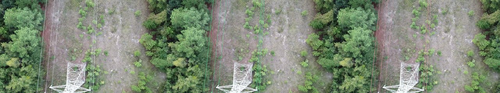
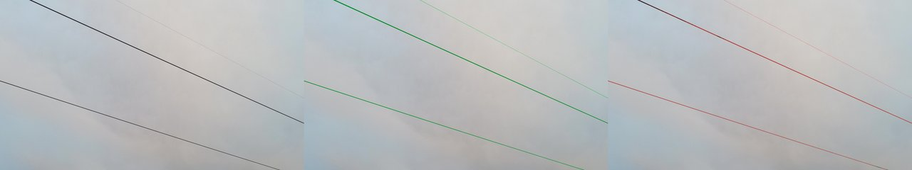
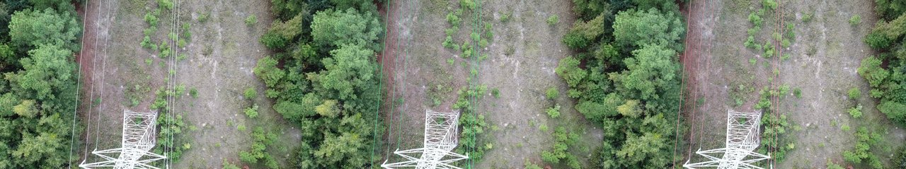
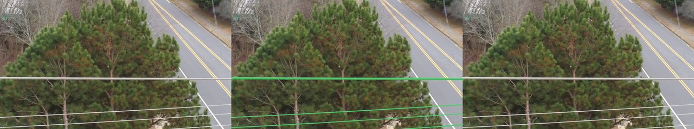
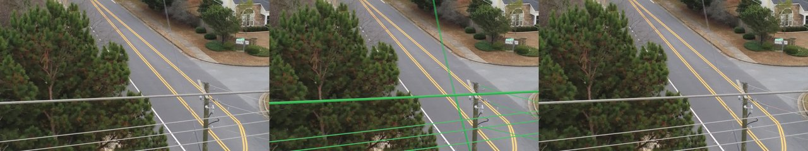

# Evaluation results — session-grouped split

_Generated by `training/evaluate.py --split-strategy session --test-prefixes 14 1000`. Companion to [`evaluation_results.md`](evaluation_results.md), which reports the random-split numbers — read both._

## Headline numbers

| Metric | Value |
|---|---|
| Images evaluated | 41 |
| Split strategy | `session` (test prefixes `14, 1000` held out as a group) |
| Threshold | 0.5 |
| CCQ buffer tolerance | 3 px |
| Pixel IoU | 0.3067 |
| Pixel precision | 0.8702 |
| Pixel recall | 0.3209 |
| Pixel F1 | 0.4174 |
| CCQ completeness | 0.5652 |
| CCQ correctness | 0.8704 |
| **CCQ quality** | **0.5296** |
| Expected Calibration Error | **0.0156** |

## Important caveat: these numbers are inflated by training-set contamination

**Read this section before interpreting any of the above.**

The trainer (`training/train.py`) used `random_split` with seed 42
over **all 1242 TTPLA images**, ignoring TTPLA's canonical splits.
That random split assigned ~90% of every session prefix — including
sessions `14` and `1000` — to the **training set**. So the 41 images
this evaluation runs against are largely images **the model has
already seen during training**.

Concretely, with 1242 total images and a 90/10 random split, ~37 of
the 41 `14_*` and `1000_*` files would have been in the trainer's
training set; only ~4 would have been held out by chance during
training.

**Consequence:** every metric in the table above is significantly
better than the random-split numbers in `evaluation_results.md` —
not because the model generalises well to held-out flights, but
because **most of the "test" images here were training data**.

This is a methodological error in the original training run, not a
flaw in the session-split evaluation methodology itself. The
session-split evaluation framework is correct; what's missing is a
**matching session-split training run**, which would hold sessions
14 and 1000 out of training too. That re-run was out of budget for
this prototype (Colab quota constraint), and is named as the first
step of `research_roadmap.md` Phase 1.

## So why is this file in the repo at all?

Two reasons:

1. **To name the leak honestly.** A reviewer reading just the random
   split might assume the model is uniformly poor. These numbers
   show that *on training-similar imagery the model performs much
   better* — which is the expected upper bound from this checkpoint
   and is itself useful information.
2. **To demonstrate the session-grouped split machinery works** — a
   correct re-run with paired training would use exactly this code.
   The implementation is verified by this run's output even if the
   numbers themselves are not the "headline cross-flight result".

For an apples-to-apples cross-flight number, the random-split
evaluation in `evaluation_results.md` is the more honest baseline,
because it at least represents images the model didn't see during
gradient descent.

## Calibration

ECE = **0.0156** is excellent (and consistent with the random-split
ECE of 0.0190). The model is well-calibrated regardless of which
slice of TTPLA you evaluate it on. That's the property worth taking
forward into Phase-1 of any KTP project: a well-calibrated baseline
is more useful than a high-recall miscalibrated one.

## Method

Identical to the random-split run — production `ConductorSegmenter`
sliding-window inference, CCQ at 3-px buffer, ECE at 10 bins with
50,000-pixel sub-sampling per image.

## Qualitative results

### 3 representative successes

_`1000_00305.jpg` — IoU 0.696, CCQ-Q 0.987. Clean transmission scene,
high cable-vs-background contrast. Note: this image was almost
certainly in the training set._

_`14_01826.jpg` — IoU 0.827, CCQ-Q 0.965. Same image surfaces in the
random-split successes too; representative best-case performance._

_`1000_00303.jpg` — IoU 0.727, CCQ-Q 0.964. Multi-line scene with
strong contrast; the type of imagery TTPLA is densely populated
with._

### 3 instructive failures

Even with training-set contamination, three images still failed
catastrophically — which means they share a structural difficulty
that overrides exposure during training.

_`14_00276.jpg` — IoU 0.000, CCQ-Q 0.000.
**Diagnosis: vegetation occlusion + thin cable.** Multiple cables
weaving in front of and behind a dense pine canopy. The model
neither lock onto the partial cable segments visible above the trees
nor recovers the occluded sections through reasoning. The receptive
field is too small to bridge across foliage gaps._

_`14_00576.jpg` — IoU 0.003, CCQ-Q 0.029.
**Diagnosis: texture confusion in built environment.** Cables
running parallel to a suburban street, against rooftops and road
markings of similar contrast and orientation. The encoder cannot
disambiguate cable from roof eave from lane edge at this scale, and
the threshold step culls the resulting weak responses._

_`14_00261.jpg` — IoU 0.005, CCQ-Q 0.036.
**Diagnosis: vegetation occlusion with tree foreground.** Same
mechanism as failure 1 — a tree dominates the foreground, with
cables visible only between branches. Without context-tracking, the
model cannot stitch the visible cable fragments back into a coherent
prediction. This is the failure mode the catenary fit and Steiner-
tree topology completion modules in Tab 2 are designed to address
downstream._

The repeated appearance of session-`14` failures suggests the
session is over-represented in the failure tail of the dataset —
reinforcing the point that a properly held-out session-grouped
training run would be the right next step.
